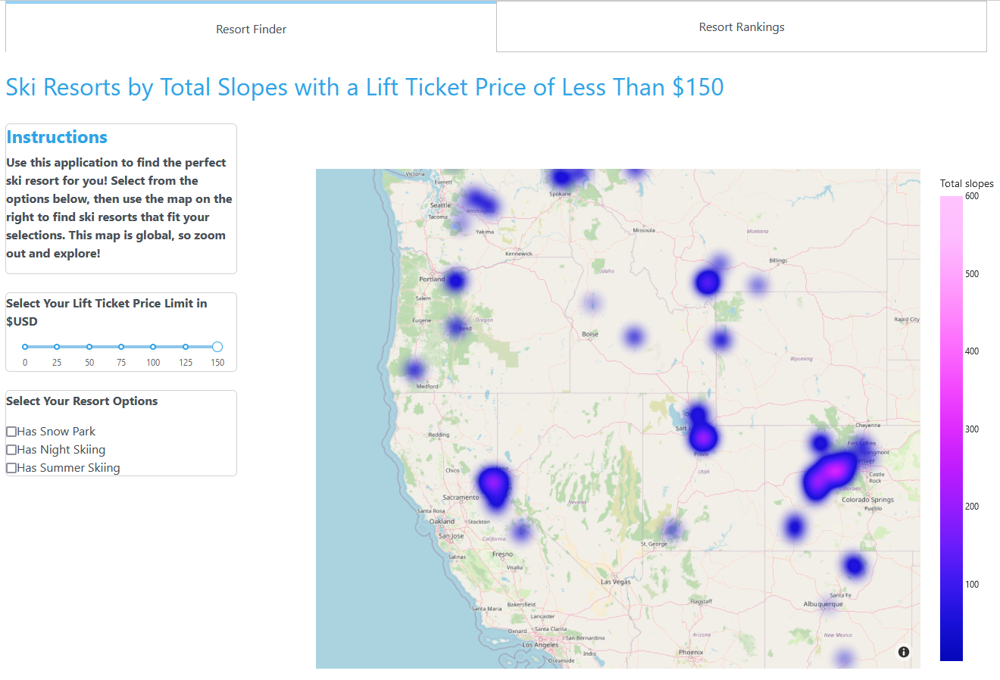
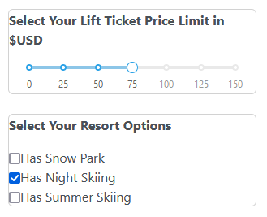
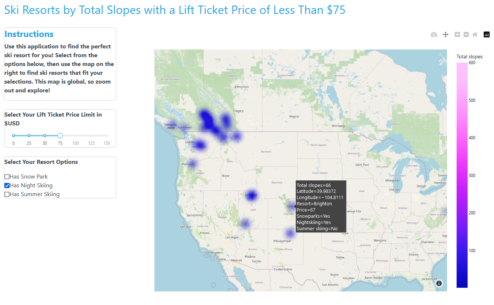
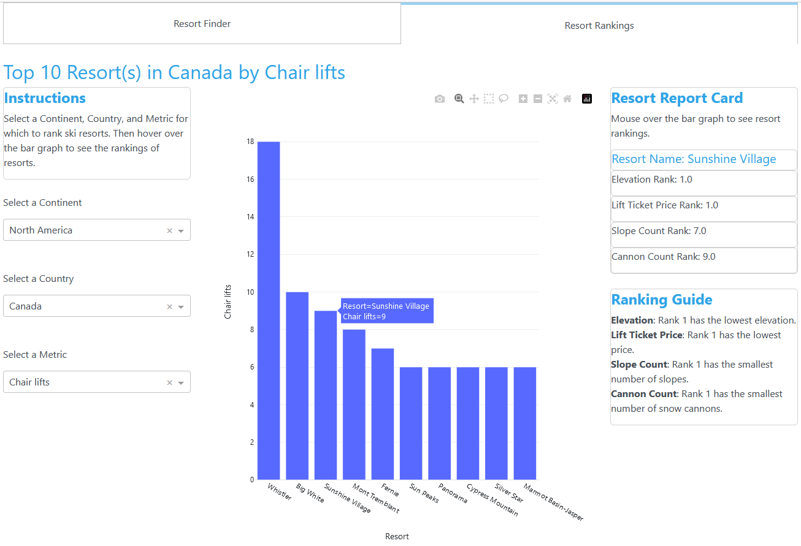
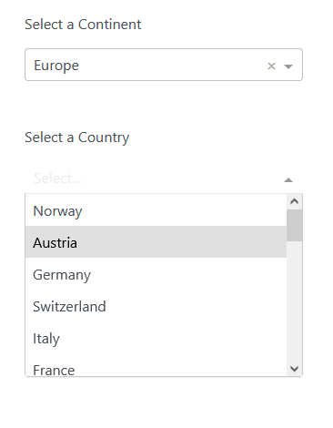
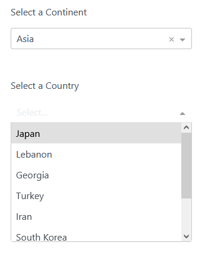
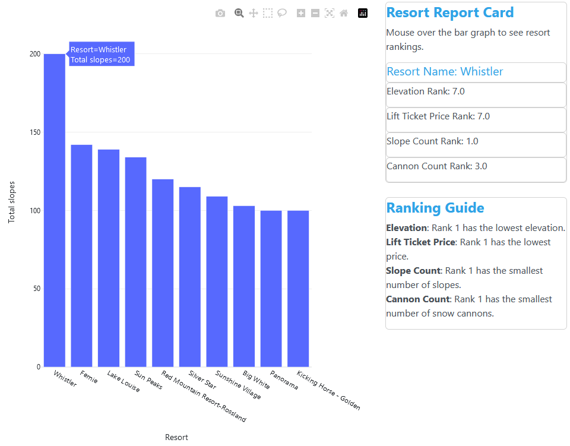
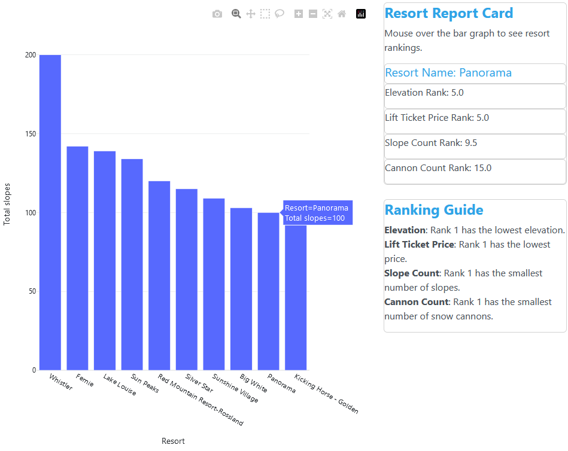

# Ski Resort Explorer
A Dash web application.

## Project Summary
The goal of this project was to construct a simulated ski resort explorer application that enables the user to perform the following tasks:
- Identify ski resorts around the world that fit the user's preferences
- Select ski resorts within a selected country and rank them according to a desired metric

This application was constructed as the final project from the [Python Data Visualization: Dashboards with Plotly & Dash](https://www.udemy.com/course/python-dashboards-plotly-dash/) course from Udemy. It primarily utilizes the [Plotly Express](https://plotly.com/python/plotly-express/) and [Dash](https://dash.plotly.com/) libraries. Additional aesthetic effects were achieved using the [Dash Bootstrap Components](https://dash-bootstrap-components.opensource.faculty.ai/) library. 

This application is hosted online at https://resort-explorer.onrender.com/. Please allow a few minutes for the page to load.

*Please note that the purpose of this application is to illustrate the use of the Plotly and Dash libraries. The underlying dataset may contain errors and inaccuracies and therefore should not be relied on as a source of factual information.*

## Part 1: Resort Finder Map
The first tab of the application presents the user with an interactive global map with which they can locate ski resorts that match their preferences selected from a set of options. The title at the top of the page is dynamic and changes to reflect maximum lift ticket price selected by the user.

  

The underlying data is obtained from a spreadsheet that contains information pertaining to hundreds of ski resorts around the world, including but not limited to:
- Resort name
- Resort Location (Continent, Country, Longitude and Latitude)
- Lift ticket price
- Number of chair lifts, gondola lifts, and slopes
- Availability of nighttime skiing, summer skiing, and snow parks
- Number of snowmaking cannons
- Country-specific rankings for elevation, lift ticket price, snow cannon count, and slope count

The user first selects a maximum lift ticket price from the slider. Next, using the provided check boxes, the user selects whether the resort of interest has a snow park, night skiing, and/or summer skiing. 

  

The selected price and options are passed to a callback function that filters the dataset accordingly, removing resorts that do not fit the user's preferences and price range. The function updates the [density mapbox](https://plotly.com/python/mapbox-density-heatmaps/) visualization to include only the filtered resorts. The resorts are color-coded by the total number of slopes. The user is able to mouse over the resorts to view additional additional information in the tooltip. Additionally, the callback function modifies the title of at the top of the page based on the selected lift ticket price.

  

## Part 2: Resort Rankings

The second tab of the application displays a bar graph showing the "top" ski resorts for a country and metric selected by the user, up to a maximum of 10. The user can then hover over the bar graph pertaining to a specific resort, which will update the Resort Report Card with additional ranking information pertaining to the selected resort. The title at the top of the page is dynamic and changes to reflect the selected country and number of resorts displayed in the bar graph.

  

First, the user selects a Continent, Country, and ranking Metric from the provided dropdown menus. The **Country** dropdown menu is dynamic and changes based on the selection made from the **Continent** dropdown menu. This behavior is handled by a dedicated callback function that accepts the input from the **Continent** dropdown menu and filters the options available in the **Country** dropdown accordingly. 

<!-- 

  

  

 -->

  
   

Next, the user selects a Metric from the **Metric** dropdown menu by which the ski resorts are to be ranked. The Country and Metric selections feed into a second callback function that filters the dataset to the ski resorts within the selected country and ranks them according to the selected metric. The function then generates a bar graph with the sorted rankings of the resorts. 

Finally, the user can update the **Resort Report Card** on the upper right corner of the page by hoving over the bar graph to the resort of interest. This is handled by a third callback function that receives the resort name when the user hovers over a bar in the bar chart and returns that resort's intranational ranking for elevation, lift ticket price, slope count, and snow cannon count. A ranking guide is provided that explains how to interpret the rankings for each metric.

  

  

